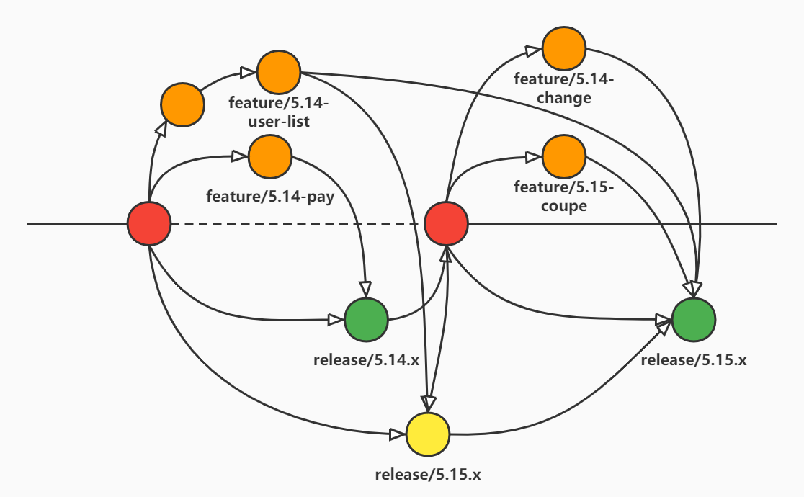

# 
FoneFlow分支模型

## 简介

&nbsp;&nbsp; 为了良好的工作配合和代码分支管理，借鉴阿里的AoneFlow的分支管理模型，对其适配于我司的具体开发情况； 
&nbsp;&nbsp; FoneFlow使用三种分支类型：主干分支（master）、特性分支（feature）、发布分支（release）。 

- master分支为长期的受保护的稳定分支（红色）
- release分支为短期的受保护的当前开发的发布分支（绿色）
- release分支为短期的受保护的超前开发的发布分支（黄色）
- featture分支为短期的特性功能分支（橙色）

## 说明

FoneFlow与AoneFlow类似，FoneFlow的分支描述图如下：

### 1.规范

&nbsp;&nbsp;分支的开发需要遵守以下四个规则：

- 开始工作前从主干创建特性分支

    - &nbsp;&nbsp;当开始一件新的工作项，如新功能或修复问题时，从 master 主干分支上以最新tag创建一个以 feature/ 为前缀的特性分支，不论单人还是多人的合作项目，都将提交到该特性分支上；在FoneFlow的规则中，每一个 feature/ 特性分支至少代表一个功能或者一个子项目，不可以将多个功能或子项混合到该特性分支。 

- 通过合并特性分支形成发布分支

    - &nbsp;&nbsp;多个即将发布的 feature/ 特性分支通过合并的方式形成一个发布分支，其中任何已知的问题不可以通过对 release/ 发布分支直接进行修改，而是通过 feature/ 特性分支的方式合并至发布分支；在FoneFlow的规则中，release/ 发布分支会在一定的窗口期由分支维护者创建，该分支是受保护的，提交和合并需通过PR/MR进行提交，方便CodeReview； 

    - &nbsp;&nbsp;黄色的 release/ 发布分支为超前开发的发布分支，当一部分已通过测试的 feature/ 特性分支未能在此次发布中合并，那就将该特性分支合并到黄色的超前发布分支中，用于合并至 master 主干下一个迭代生成的绿色 release/ 发布分支中； 

    - &nbsp;&nbsp;具体的窗口期根据版本迭代周期由团队自行制定，该窗口期相当于维护团队进行项目部署、CodeReview、测试及集成测试的周期。 

- 发布到生产环境后，合并相应的发布分支到主干并添加标签，同时删除该发布分支关联的特性分支

    - &nbsp;&nbsp;当一条发布分支上的流水线完成了一次生产环境的部署，就意味着相应的功能真正的发布了，此时应该将这条 release/ 发布分支合并到 master 主干并创建与之对应的版本标签；为了避免在代码仓库里堆积大量历史上的特性分支，还应该清理掉已经上线部分特性分支；如果要回溯历史版本，只需在主干分支上找到相应的版本标签即可。 

- 生产环境中存在的问题需从对应的主干版本进行Hotfix

    - &nbsp;&nbsp;基于生产环境存在问题的对应版本创建一条Hotfix，同时为这个分支创建临时流水线，以保障必要的发布前检查和冒烟测试能够自动执行，Hotfix本质上与 release/ 发布分支没有太大区别，实质为一条临时的发布分支。 

### 2.流水线的配合

- master流水线
    - 生产流水线是 master 主干分支，上线由运维人员使用Jenkin在内网手动打包并创建相应版本tag进行发布；
    - 由运维人员将打包后的程序部署至 生产环境。

- test流水线

    - 测试流水线实际上是一条受保护的 test 分支，当特性分支开发完毕自测完毕时，需要提测的时候，合并到 test 分支，由钩子程序触发Jenkins自动部署至 测试环境；
    - 当 release/ 发布分支正式上线至生产环境后，使用 release/ 发布分支合并至 master 之后，由 master 分支覆盖合并至 test 分支；

- dev流水线
    - 开发流水线实际上是一条不受保护的 dev 分支，仅为了方便开发在开发过程中的开发“乐趣”及历史遗留问题，需要自测的时候合并至 dev 分支，由钩子程序触发Jenkins自动部署至 开发环境；
    - 开发流水线会定期以 master 主干分支覆盖。