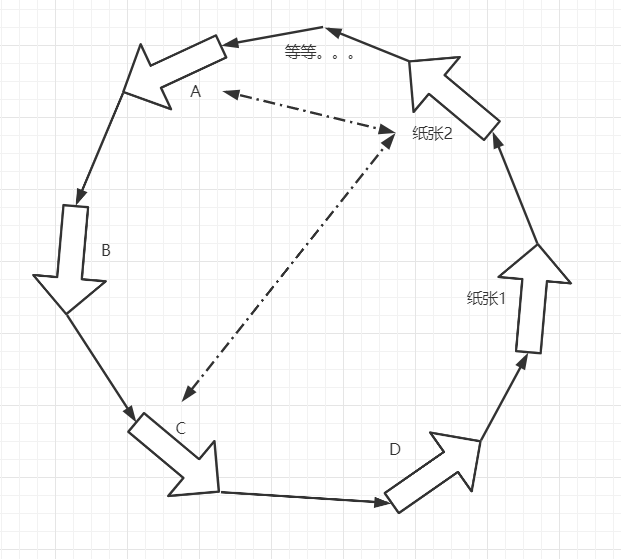

---

layout: post
title: "程序的演变"
date: 2022-05-19 13:00:00
image: ''
description: '用通俗的话来粗略地讲一下我所了解的程序的演变过程'
tags:
- event-loop
- 编程
categories:
- Chaz6chez

---


## 前言

我是一名后端开发工程师，目前从事后端开发有8年的经验，主要以PHP开发为主，期间有1年时间使用C语言进行PHP拓展的开发工作，
工作主要围绕辅助线程及有栈协程调度器；还有2年主要使用Golang做一些基础服务。

这篇文章我会用一些通俗的话来描述一些我所了解的程序的一些点，如 异步、同步、阻塞、非阻塞等；当然，我的经验不算丰富也可能有些理解错误的地方，
也希望能够指正我描述有错误的部分。

## 程序出生了

程序最开始就如同写文章一般，从上至下，然后伴随着一个return结束：

```
#include<stdio.h>

main(){
    return 0;
}
```

这个程序对于系统来说是一个唯一入口，有点类似于PHP的index.php入口对于PHP zendVM一样，也是唯一入口：

```
<?php
    # 啥也没有
?>
```
道理是这么一个道理，Golang也一样，Java也一样；

这样的程序其实跟脚本是类似的，从上执行到结束、退出；既然这样的程序和脚本类似，我么就把它比作一张纸，
我们可以在这张纸上胡作非为，写上A\B\C\D随便什么都可以，它就会按照从上到下直到结束：


如上图，这个程序就完成了一个结合了A+B+C+D的业务逻辑，我们称它ABCD；

这时候你可能又会想，如果我要完成ABC的业务逻辑，怎么办？有两种办法：

- 再写一个ABC的程序
- 给这个ABCD丰富一下，加一个判断

于是我们丰富了一下程序，利用了编程语言基础的逻辑判断的特性：


但是我们不满足于此，因为A\B\C\D都有可能带来判断，甚至可能加入E\F\G等等等等……

那么这时候，程序如果按照这样的发展趋势，应该会变成：


CAO！这肯定不是每个程序员想要的结果！

那么为了拯救这样的情况出现，我们索性用多张纸且明确划分区域地来完成这样的复杂的、
多功能的程序，每个纸张上都各自有不同的ABCD或EFGH，这种编写程序的方式就是面向对象编程；
当然过程对象也可以达到这个效果，只不过需要引入各式各样的纸张，且不同纸张内容可能出现重复，
甚至不符合人的思维逻辑：


## 它转起来了！

我们上述的所有程序，都不能自动的反复的执行;
> 这里面包括C、Golang等语言，只要不引入一些库就纯粹的运行来说，它们和脚本是无异的

但是我们在生活中无时不刻的做着重复的事儿，毕竟人类的本质是复读机嘛；那么我们程序怎么做到重复执行呢？
有以下两种办法：
- a. 重复几次就手动执行几次
- b. 让程序住在系统里自己执行

懒人能推动社会进步，我选B。

那么为了实现这样的程序，我们该怎么做呢，怎么让这个程序不断地重复重复再重复呢？这时候可以利用语言特性：
**循环**，在循环的作用下，由上至下的程序则会变成这个样子：


wocao！它转起来了，转起来了！这不就是常驻内存的程序吗？当然，这里面我省略了一些接受系统通知、监控的步骤，
那么我们就假设这个圈就是一个系统，每个纸张就是程序，循环飞速的运转，那么每个程序都可以快速的运转，
这样一看，它是不是就变得丰富形象且生动了？

## 它蜕变了！

我们把这个”系统“的目光收一收，把目光再次聚集到每张纸张上面的A\B\C\D，你会发现ABCD该顺序执行的还是顺序执行，
纸张1没执行完，纸张2就不会到，因为在这个循环的圈中也是顺序执行的，怎么办呢？我能不能把A\B\C\D打散？
把每张纸聚焦在该做的事儿上？可以。

这里我们可以把这些A\B\C\D理解为系统的一些程序，比如文件系统、socket等，我们上层的应用就是使用他们的纸张，
去组合出ABC等一些特性的上层程序，我们的”纸张“和A\B\C\D一样，也在这个大循环内，我们的程序也可以通过一些共享手段与它们通讯/交换信息，
如下图：



为了避免每个程序一直挂在那里影响循环后面的其他程序，通常来说都需要合理的分配每个程序执行的最大时间，
如果没执行完，那就等下一个循环接着执行（具体可以看看Linux时间片算法，这里不展开说了）；假定每个程序最大执行时间是1秒，
那么如图所示的“循环”去除“等等”部分，转一圈需要6秒；假设A执行一次需要6秒，那么A就需要转六圈才能完成一轮业务，其他的同理。

- **同步阻塞**

在“纸张2”需要一直等待结果的情况下（就好比你致电10086询问你的话费余额，电话那头告诉你等一下，你就一直拿着电话等她回答你），
我们假设A需要6秒，C需要10秒，那么“纸张2”完成自己的业务逻辑那么就需要先让A转完6圈，再去通知C，然后再等C转完10圈，最后就是16圈，
那么在第17圈的时候“纸张2”才能拿到所有数据。

- **异步**

那么我有没有办法做到同时通知两位，然后在等待呢？有：

1. “纸张2”开两个线程（线程和进程的关系这里不展开讲，可以自行查阅，因为线程又是另一个“圈”的事儿了），一个通知A，一个通知C；

2. “纸张2”告诉A：“有结果了就放在门卫大爷A那，我去拿”，然后紧接着通知C：“有结果了就放在门卫大爷C那，我去拿”；

**1号方案和2号方案其实在本质上没太大区别，因为在linux下面实际上没有真正的线程，无非就是多了一个循环的事儿，
即便多了真·线程的概念，实际上运行起来也差不多，反正也是需要切出去再回来的；**

“纸张2”除了需要维护一个不断查询门卫大爷的逻辑外，不需要多余在维护什么，那么这个转圈的事儿，就可以变换成如下的逻辑：
“纸张2”分别告诉A和C，于是开始转圈，第一圈的时候A和C都消耗了1秒，直到第6圈A完事儿了，第7圈的时候“纸张2”拿到了A的包裹；
第10圈的时候，C完事儿了，第11圈的时候“纸张2”拿到了C的包裹，程序结束；那么这个程序就执行了11圈，比之前的17圈要快一些。

**实际上这个逻辑就是linux select/poll的执行逻辑，如果算上“纸张2”自己还需要查寻门卫大爷的时间的话，是不止17圈的，
因为每一圈“纸张2”都需要去问大爷，这里只是做了一个忽略；如果假设询问大爷需要消耗2圈的话，那么至少要在第19圈才可以拿到结果**

还有没有更快的方案呢？有：
**让A和C完事儿的时候告诉我一声**

这时候“纸张2”是不需要去询问大爷，只需要在A、C完事儿通知到的时候去大爷那里取，这样的时间消耗是最接近17圈的。

**这种方式就是linux epoll的执行方式，也是类似于kqueue或者IOCP的执行方式，当然系统不同，时间分配的方式也不同，
整体的执行方式也稍微有所调整**

## 总结

- 异步至少需要两个线程/两个进程
- 非阻塞需要对应“程序”/“纸张”支持
- 同步还是异步、阻塞还是非阻塞，需要界定范围，有可能微观的看是非阻塞，但宏观看是阻塞的
- 世界是个圈，圈里也有圈，怎么维系好自己的圈，做好内圈与外圈的联系，会让世界变得更好
- **如有错误请指正！！**

## 暂时想到的只有这么多，如果想到其他的，再说